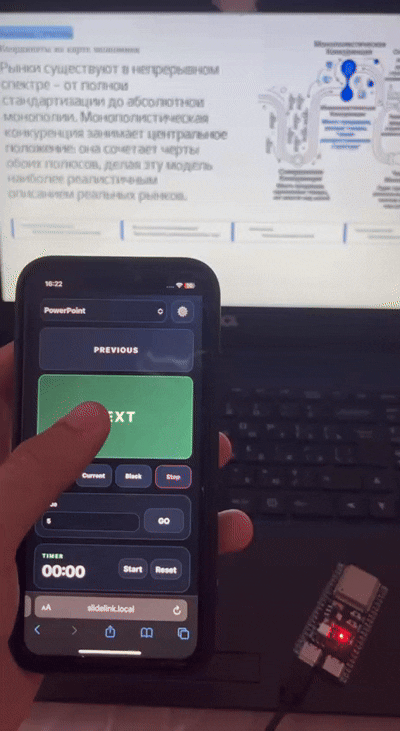
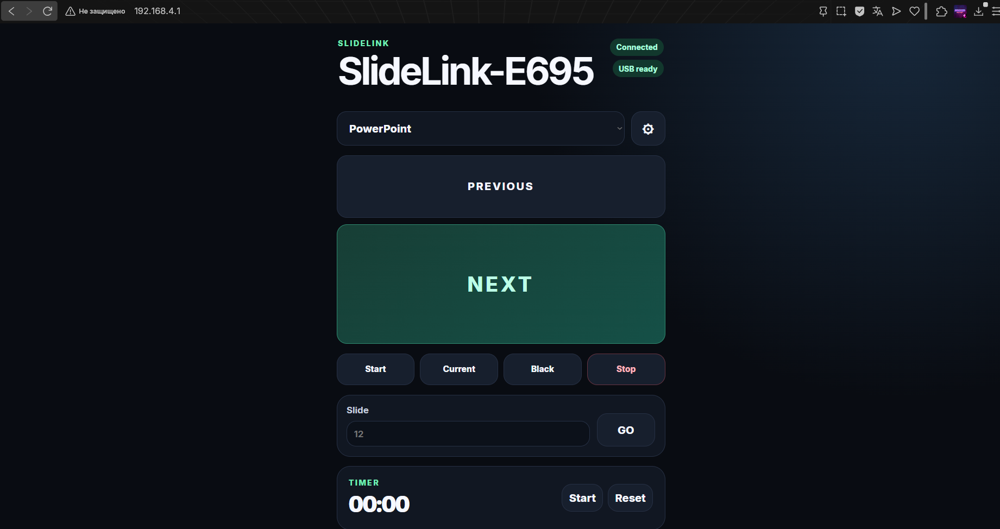

# SlideLink — ESP32-S3 Remote Presenter

<p align="center">
  
</p>

SlideLink is an autonomous presentation remote for ESP32-S3. The board appears
to the computer as a driverless USB HID keyboard and hosts a private Wi-Fi web
interface that works without a router or Internet connection.

Current milestone: **v0.2.0 — Autonomous Web Remote**.

Stable release: [v0.1.0 — USB HID Presenter Core](https://github.com/maggogerka/esp32-s3-remote-presenter/releases/tag/v0.1.0).

## Features

- Native ESP32-S3 USB HID keyboard with no host-side application or driver
- WPA2 SoftAP at `192.168.4.1` and `http://slidelink.local`
- Responsive offline web remote embedded in the firmware
- HTTP command API and WebSocket command-result notifications
- Six editable profiles: PowerPoint, Google Slides, LibreOffice Impress,
  Generic PDF and two custom profiles
- Strict key and modifier allowlist; arbitrary keyboard input is impossible
- Profiles and active-profile selection persisted in NVS with schema and CRC32
- First-run Wi-Fi password and 4–8 digit PIN provisioning
- Salted PIN hash, random RAM-only session tokens, sliding expiry and login
  throttling
- BOOT button: short press for next, at least one second for previous, and at
  least eight seconds for a physical factory reset
- Bounded HID waits, an eight-item queue, release reports and stale-command
  protection across USB disconnects and resets

## Hardware connection

The two USB roles are deliberately separate:

```text
ESP32-S3 USB-UART connector (CH343/CP210x) --> flashing + 115200-baud console
ESP32-S3 native USB/OTG connector            --> Windows HID keyboard
                                                   GPIO19 = D-
                                                   GPIO20 = D+
```

Use the connector labelled `USB`, `OTG`, or `Native USB` for HID. A connector
that appears as CH343/CP210x is only the UART bridge. Both cables may remain
connected.

## First run

1. Flash the firmware and wait for the setup access point named
   `SlideLink-XXXX-Setup`.
2. Connect with the initial password `slidelink-setup`.
3. Open `http://192.168.4.1` and choose a new WPA2 password plus a 4–8 digit
   control PIN.
4. After the automatic restart, reconnect to `SlideLink-XXXX` using the new
   password and open `http://192.168.4.1` or `http://slidelink.local`.
5. Enter the PIN, select a profile, and use the remote.

The ESP32-S3 does not provide Internet access. A phone may show “no Internet”;
stay connected to the SlideLink network. The web interface is HTTP inside the
device's isolated WPA2 network, not HTTPS.

Hold BOOT for at least eight seconds to erase the Wi-Fi password, PIN and all
profile changes. The board then restarts in setup mode.

## Build and flash

Prerequisites: ESP-IDF 6.0.2 and an ESP32-S3 board with native USB exposed.

```powershell
idf.py --version
idf.py set-target esp32s3
idf.py build
idf.py -p COM10 flash monitor
```

The component manager uses the dependency graph in `dependencies.lock`.
The v0.2.0 application binary is about 902 KiB. The firmware version comes
from ESP-IDF project metadata (`version.txt`) in the boot log, UART status and
system API.

## Verified environments

Only combinations that were exercised end to end are marked as verified:

| Host | Application | Result |
|---|---|---|
| Windows 10 Pro 22H2, build 19045 | Microsoft PowerPoint 16.0, build 14332 | Pass: every presenter command, 200 slide switches, USB reconnect/reset and sleep/resume |
| Windows 11 | Microsoft PowerPoint | Not tested |
| Any | LibreOffice Impress | Not tested; LibreOffice was not installed on the validation host |
| Any | Google Slides | Not tested; the default profile is supplied but has not been application-validated |
| Any | PDF viewer | Not tested; shortcuts vary by viewer |

The firmware itself was built with ESP-IDF 6.0.2 and tested on an ESP32-S3
QFN56 revision 0.2 board. See [docs/compatibility.md](docs/compatibility.md) for
the board, USB identity, test date and full hardware results.

## Web remote and profiles

The main screen provides large Previous and Next controls, slideshow actions,
direct slide navigation, an elapsed timer, USB/Wi-Fi status and live execution
results. The profile editor supports up to four allowlisted key steps per
binding, Shift/Ctrl/Alt modifiers and bounded delays. A binding can be tested
without saving it.



*SlideLink v0.2.0 running locally at `192.168.4.1`, with USB HID ready and the
PowerPoint profile active.*

Profile updates pause command intake, clear queued work, release all keys and
then atomically publish the new profile revision. A queued command from an old
profile revision is never replayed against the new mapping.

See [docs/web-api.md](docs/web-api.md) and
[docs/security.md](docs/security.md) for protocol and trust-boundary details.

## UART console

The 115200-baud console remains available for diagnostics and local control.
Commands are case-insensitive, empty lines are ignored, and input is limited to
64 characters.

| Command | Default PowerPoint action |
|---|---|
| `next` / `previous` | Next / previous slide |
| `start` / `start-current` | Start from first / current slide |
| `stop` | End slideshow |
| `black` / `white` | Toggle black / white screen |
| `first` / `last` | First / last slide |
| `goto 12` | Go to slide 12 |
| `status` / `help` | Diagnostics / command list |

`goto` accepts only decimal slide numbers from 1 through 9999. Unsupported
input is never interpreted as raw text or HID keycodes. Commands submitted
while native USB is unavailable are rejected and are not replayed later.

## Tests

The dedicated test application replaces USB with a safe test double:

```powershell
idf.py -C tests -B build-tests set-target esp32s3
idf.py -C tests -B build-tests build
idf.py -C tests -B build-tests -p COM10 flash monitor
```

GitHub Actions compiles both production and test firmware. CI has no attached
ESP32-S3, so it does **not** execute the Unity suite. Execution is recorded only
from a manual hardware run. The 2026-07-18 COM10 run passed all 11 tests, and
production firmware was restored afterward.

The Windows/PowerPoint hardware procedure and exact results are in
[docs/usb-testing.md](docs/usb-testing.md) and
[docs/compatibility.md](docs/compatibility.md).

## USB identity and safety

- Manufacturer: `Maggogerka`
- Product: `SlideLink USB Presenter`
- Device class: HID keyboard
- Development VID:PID: Espressif default `303A:4004`

The Espressif VID/PID is appropriate only for this non-commercial prototype.
A commercially distributed product needs an assigned USB VID/PID.

SlideLink accepts no arbitrary text, scripts, operating-system commands or raw
HID reports. It sends no HID input at boot and persists no command queue.

## Documentation

- [Architecture](docs/architecture.md)
- [Web API](docs/web-api.md)
- [Security model](docs/security.md)
- [USB and PowerPoint test plan](docs/usb-testing.md)
- [Compatibility matrix](docs/compatibility.md)

## Roadmap

- v0.1.0: USB HID core
- v0.2.0: Autonomous Wi-Fi web remote and persistent profiles
- v0.3.0: Autonomous web-remote hardening, OTA updates and configuration backup
- v0.4.0: Optional companion integrations

Licensed under the [MIT License](LICENSE).
